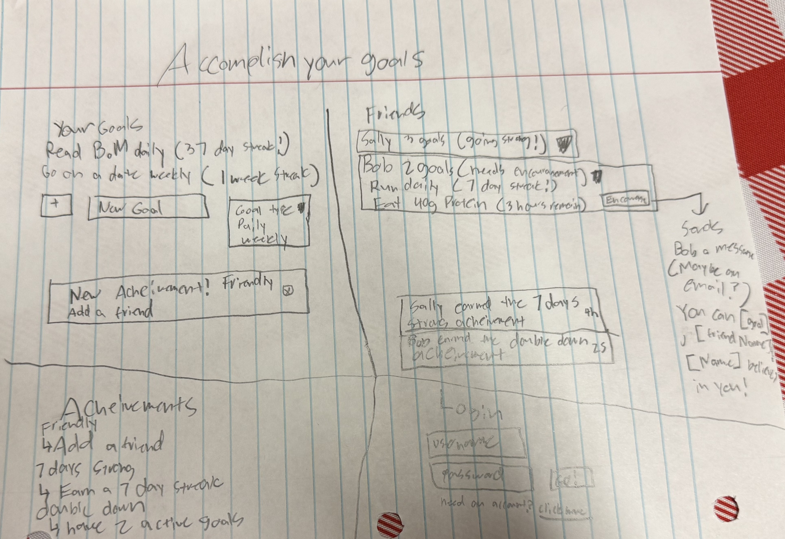
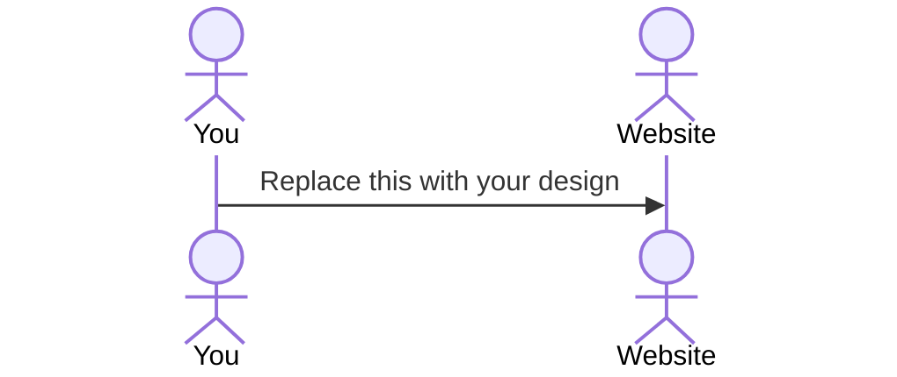

# Accomplish Your Goals

[My Notes](notes.md)

This app is here to help you and your friends track your goals. You can see how they are doing with their goals and support them on their journey. They will be able to do the same for you. You can earn achievements as you accomplish your goals and help your friends.

## 🚀 Specification Deliverable

For this deliverable I did the following:

- [x] Proper use of Markdown
- [x] A concise and compelling elevator pitch
- [x] Description of key features
- [x] Description of how you will use each technology
- [x] One or more rough sketches of your application. Images must be embedded in this file using Markdown image references.

### Elevator pitch

Remember that time you actually accomplished all of your goals? Yeah, me neither. Well, being accountable will help you accomplish more of them. This app intends to assist you in realizing additional goals by aiding you track progress and find friends to cheer you on. Earn accolades by being consistent with your goals and by helping other users stay motivated. See other people's achievements as they do the same. Now you have a community to help you carry out your aspirations.

### Design

### Key features

- A place to track your goals
- Add friends and see their goals
- See achievements you can earn
- Login using HTTPS
- See other's achievements in real time

### Technologies

I am going to use the required technologies in the following ways.

- **HTML** - 4 pages in HTML.
- **CSS** - Style that will fit the user's screen.
- **React** - Login, see friend's progress, add new goals.
- **Service** - Chat service to encourage your friends!
- **DB/Login** - Store users and their goals, save their friends.
- **WebSocket** - See other's achievements in real time.

## 🚀 AWS deliverable

For this deliverable I did the following:

- [x] **Server deployed and accessible with custom domain name** - [My server link](https://goalz.click).

## 🚀 HTML deliverable

For this deliverable I did the following:

- [x] **HTML pages** - I have 4 complete pages for my webpage to login, track goals, add friends, and see achievements.
- [x] **Proper HTML element usage** - I used various HTML elements to represent what I was trying to display on the page. This includes text, images, links, headers, and footers.
- [x] **Links** - I have links to each of my pages in the header of each page. I also have a link to my github in the footer of each page.
- [x] **Text** - Text is used as a placeholder for many future features of my page.
- [x] **3rd party API placeholder** - The button to encourage a friend will eventually have a 3rd party API that sends an email to that friend.
- [x] **Images** - I have images for the achievements
- [x] **Login placeholder** - My home page is a login screen that does nothing yet.
- [x] **DB data placeholder** - The login screen will store information. Each user will have data stored about them like their goals, friends, and achievements.
- [x] **WebSocket placeholder** - I will have a websocket that tells people when their friends have gotten a new achievement or started a new goal in real time.

## 🚀 CSS deliverable

For this deliverable I did the following:

- [x] **Header, footer, and main content body** - Navigation and flex displays.
- [x] **Navigation elements** - These are displayed at the top of the page.
- [x] **Responsive to window resizing** - I remove the navigation and footer when the screen height is too small. I also remove some side padding when there isn't enough width.
- [x] **Application elements** - I styled each of my elements and used bootstrap for buttons and text boxes.
- [x] **Application text content** - I aligned my text using CSS
- [x] **Application images** - I used CSS to set my image's size.

## 🚀 React part 1: Routing deliverable

For this deliverable I did the following. I checked the box `[x]` and added a description for things I completed.

- [x] **Bundled using Vite** - I set it up as an NPM package. I then installed vite to use during development.
- [x] **Components** - The pages are now each their own jsx file with the header and footer being its own jsx file.
- [x] **Router** - The app now uses a React router to navigate between the pages. Now this is pod racing.

## 🚀 React part 2: Reactivity

For this deliverable I did the following. I checked the box `[x]` and added a description for things I completed.

- [x] **All functionality implemented or mocked out** - I made a lot more components. My pride and joy is the timer and streak functionality I made in the time.js file.
- [x] **Hooks** - React `useState` is used for variables that will be displayed. `useEffect` is used to force the page to render certain items correctly on reload/open. This is because some items aren't formatted correctly before being passed to the component that needs them.

## 🚀 Service deliverable

For this deliverable I did the following. I checked the box `[x]` and added a description for things I completed.

- [x] **Node.js/Express HTTP service** - Express installed!
- [x] **Static middleware for frontend** - Check auth, making sure only the right goals are served up, etc.
- [x] **Calls to third party endpoints** - From the friends page I call a quote service.
- [x] **Backend service endpoints** - Check auth, delete goals, add goals, etc.
- [x] **Frontend calls service endpoints** - The frontend now uses the backend services!

## 🚀 DB/Login deliverable

For this deliverable I did the following. I checked the box `[x]` and added a description for things I completed.

- [ ] **User registration** - I did not complete this part of the deliverable.
- [ ] **User login and logout** - I did not complete this part of the deliverable.
- [ ] **Stores data in MongoDB** - I did not complete this part of the deliverable.
- [ ] **Stores credentials in MongoDB** - I did not complete this part of the deliverable.
- [ ] **Restricts functionality based on authentication** - I did not complete this part of the deliverable.

## 🚀 WebSocket deliverable

For this deliverable I did the following. I checked the box `[x]` and added a description for things I completed.

- [ ] **Backend listens for WebSocket connection** - I did not complete this part of the deliverable.
- [ ] **Frontend makes WebSocket connection** - I did not complete this part of the deliverable.
- [ ] **Data sent over WebSocket connection** - I did not complete this part of the deliverable.
- [ ] **WebSocket data displayed** - I did not complete this part of the deliverable.
- [ ] **Application is fully functional** - I did not complete this part of the deliverable.
